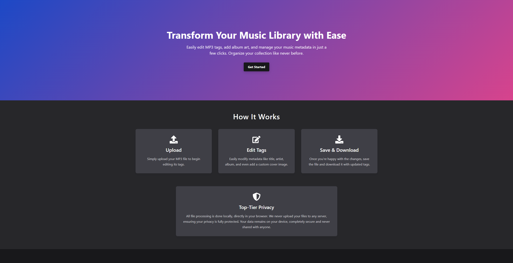
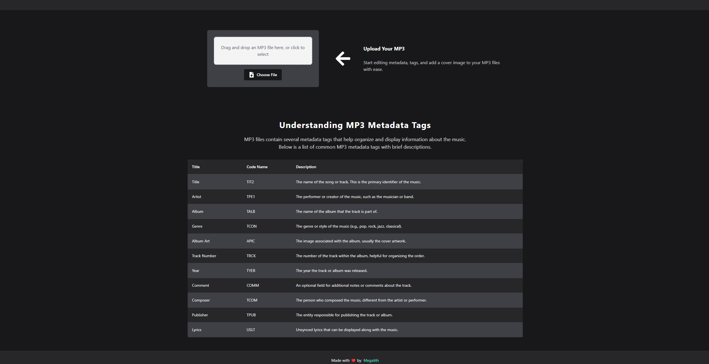

# 🎶 MP3 Metadata Editor

[](https://choosealicense.com/licenses/mit/)
[](https://reactjs.org/)
[](https://vitejs.dev/)
[](https://chakra-ui.com/)
[](https://www.framer.com/motion/)




## 🌟 Overview

The **MP3 Metadata Editor** is a modern React application that allows users to easily edit MP3 metadata tags, add album art, and manage music metadata. With a clean and minimalist design, it leverages **Chakra UI** for styling and **Framer Motion** for smooth animations.

## 🌐 Demo

Try the live demo of the MP3 Metadata Editor here: [MP3 Metadata Editor Demo](https://your-demo-link.com)

## 🚀 Features

- **✨ Modern and Minimalist Design**: Built with **Chakra UI** for a sleek, responsive interface.
- **📜 Detailed Metadata Information**: View and edit common MP3 metadata tags with brief descriptions.
- **📱 Responsive Table**: Enjoy a scrollable table layout that works on smaller screens.
- **📤 File Upload**: Upload MP3 files via drag-and-drop or file selection.
- **📝 Tag Editor**: Easily edit metadata tags and upload album cover images.
- **🎵 Song Card**: Preview your edited metadata and cover art in real-time.


## 💻 Tech Stack

- **React**: A JavaScript library for building user interfaces.
- **Vite**: Fast and lean frontend tooling for a quicker development experience.
- **Chakra UI**: A simple and accessible component library for React.
- **Framer Motion**: A powerful library for animations in React.
- **Music Metadata**: Parse music metadata seamlessly.
- **Browser ID3 Writer**: Write ID3 tags directly in the browser.
- **File Saver**: Save files on the client-side effortlessly.

## ⚡ Installation

To get started with this project, follow these steps:

1. **Clone the Repository**:
   ```bash
   git clone https://github.com/megalithofficial/mp3-metadata-editor.git
   cd mp3-metadata-editor
   ```

2. **Install Dependencies**:
   ```bash
   npm install
   ```

3. **Run the Project**:
   ```bash
   npm run dev
   ```

## 📂 Project Structure

- **App.tsx**: Main app component that ties everything together.
- **components/**: Reusable components for the application.
  - **FileUpload.tsx**: Upload MP3 files.
  - **TagEditor.tsx**: Edit MP3 metadata.
  - **SongCard.tsx**: Preview the metadata and album art.
  - **HowItWorks.tsx**: Explains how the app works.
  - **MetaTagInfo.tsx**: Provides information about common MP3 metadata tags.
  - **ui/**: Contains Chakra UI related components and utilities.

## 🤝 Contributing

We welcome contributions! If you'd like to contribute to this project, follow these steps:

1. **Fork the Repository**: Click the "Fork" button at the top right of the repository page.
2. **Clone Your Fork**:
   ```bash
   git clone https://github.com/megalithofficial/mp3-metadata-editor.git
   cd mp3-metadata-editor
   ```
3. **Create a New Branch**:
   ```bash
   git checkout -b feature/your-feature-name
   ```
4. **Make Your Changes**: Add your feature or fix the bug.
5. **Commit Your Changes**:
   ```bash
   git add .
   git commit -m "Add your feature or fix description"
   ```
6. **Push to Your Fork**:
   ```bash
   git push origin feature/your-feature-name
   ```
7. **Open a Pull Request**: Go to the original repository and create a pull request.

## 📜 License

This project is licensed under the **MIT License**. See the [LICENSE](LICENSE) file for more details.

Made with ❤️ by Megalith
